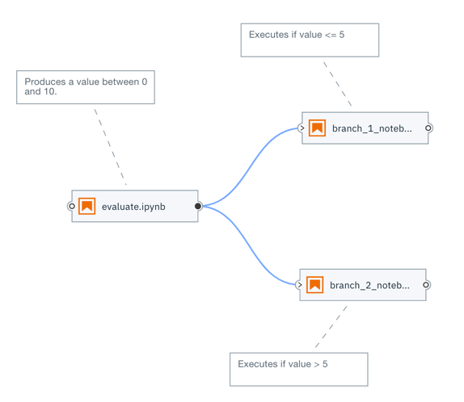

## Conditional execution

This pipeline illustrates an approach to modelling conditional node processing.

The first notebook `evaluate` produces a value. Downstream notebooks `branch_1_notebook` and `branch_1_notebook` evaluate the value and execute their cells if a certain condition is met.

Implementation details:
 - `conditional.pipeline` the pipeline file
 - `notebooks/evaluate.ipynb` notebook is always executed and produces a file that contains an integer value between 0 and 10
 - `notebooks/branch_1_notebook.ipynb` notebook that is executed if `notebooks/evaluate.ipynb` produced a file that contains a value <= 5 
 - `notebooks/branch_2_notebook.ipynb` notebook that is executed if `notebooks/evaluate.ipynb` produced a file that contains a value > 5 
 - `notebooks/skip_kernel_extension` helper script 